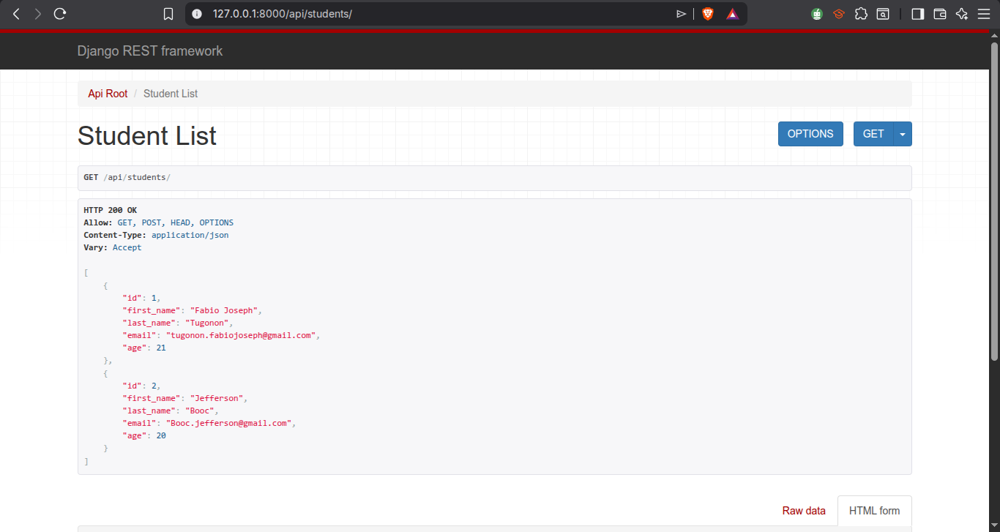
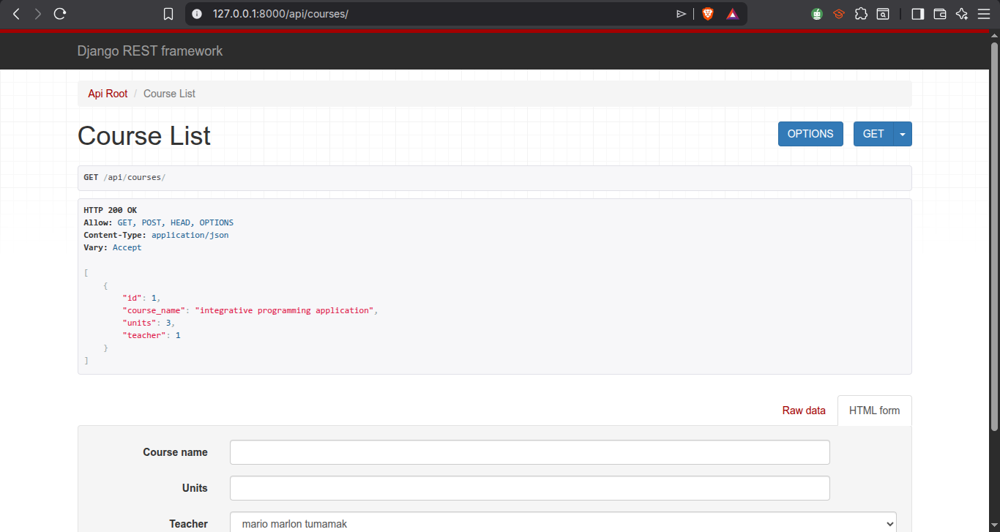
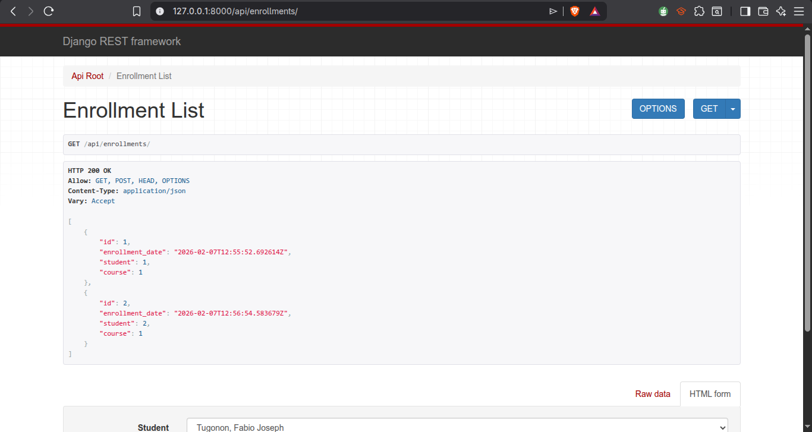

```markdown
# Student Management System – Django REST Framework

A simple CRUD-based student management system using Django and Django REST Framework.

## Features

* Student management
* Teacher management
* Course management
* Enrollment system
* RESTful API (CRUD)
* SQLite database

## Tech Stack

* Python
* Django
* Django REST Framework

## Screenshots








## How to Run

```bash
python -m venv venv
source venv/bin/activate
pip install django djangorestframework
python manage.py makemigrations
python manage.py migrate
python manage.py runserver

```

